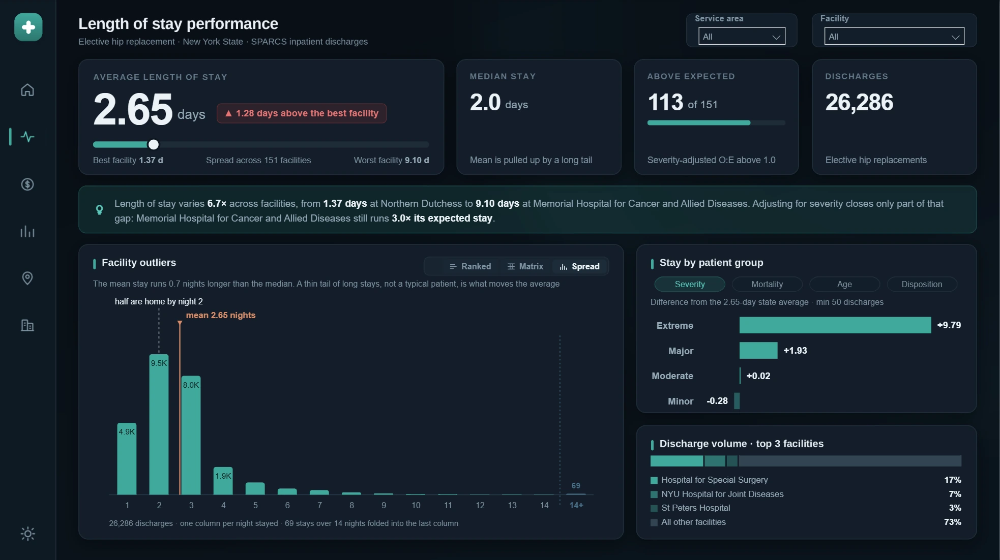
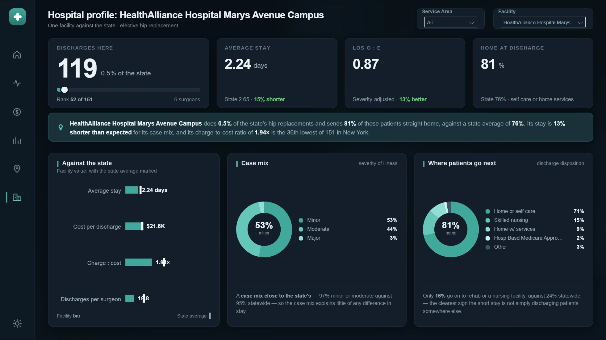

# Power BI Portfolio

Reports I have built, shown as screenshots with notes on how they are
engineered.

The .pbip files, the semantic model and the source data are not published here.
What you get is a walk through the build: the model, the measure layer, the
custom visuals, and the decisions behind each.

> Every report is built twice, once dark and once light, from a single model.
> The screenshots follow whichever theme you are reading GitHub in.

---

# Healthcare Dashboard

| | |
|---|---|
| **14** page definitions | six pages built twice for dark and light, plus a detail page pair |
| **13** tables | one fact table, three lookups, nine disconnected helpers |
| **3** relationships | in the entire model |
| **183** measures | of which **29 return HTML** and **4** return SVG |
| **60** HTML viewer visuals | 30 per theme, one for each measure that returns markup |
| **46** Deneb visuals | 23 per theme: both distributions, the choropleth, the driver panels, the card sparklines |
| **26,286** rows | one year of New York hip replacements, 151 hospitals |

This is a Power BI report about hospital performance, but the interesting part
is not the subject. It is that every number, every sentence and every colour on
screen is produced by the model. Nothing is typed into a text box. Change a
slicer and the prose rewrites itself, the units rescale, and the whole thing
re-themes from a two-row table.

It is authored as **PBIP with TMDL**, so the model is readable text and every
visual is its own JSON file. That means the report is diffable, reviewable and
patchable like any other source tree, which is how most of the fixes described
below were actually made.

Most of what you see is not a stock Power BI visual:

| What you are looking at | What draws it |
|---|---|
| Every KPI hero, tile and written insight banner on the five inner pages | a **DAX measure returning HTML**, rendered by an HTML viewer visual |
| The deviation bar in every row of the matrix | a **DAX measure returning inline SVG** as a `data:` URI |
| Both distribution charts, the region choropleth, the driver panels, the card sparklines | **Deneb**, as hand-written Vega and Vega-Lite specs |
| The landing page cards | native card visuals, each bound to a measure that returns a finished string |
| Ranked bars, matrix, scatter, slicers, buttons | native Power BI visuals |

**Jump to:** [What it looks like](#what-it-looks-like) ·
[The model](#the-model) ·
[The measure layer](#the-measure-layer) ·
[One report, two themes](#one-report-two-themes) ·
[HTML and SVG measures](#html-and-svg-measures) ·
[Deneb and Vega](#deneb-charts-written-as-vega-specs) ·
[Interaction design](#interaction-design) ·
[Performance](#performance) ·
[Testing](#how-i-test-it) ·
[Trade-offs](#trade-offs-and-what-i-would-revisit)

---

## What the report is for

One thing needs explaining before the screenshots make sense, because the whole
model is shaped around it.

A hospital with a long average stay might be doing a poor job. Or it might be
taking the sickest patients, who were always going to stay longer. A raw average
cannot tell those apart. So the spine of the model is a severity-adjusted
comparison: for every hospital, work out the stay its own mix of patients
predicts, then compare what actually happened against that.

That single requirement is what forces most of the design. It needs a measure
that can hold one filter while dropping others, a floor to stop four-patient
hospitals topping the rankings, and a set of visuals that can show observed and
expected side by side.

---

## What it looks like

### Landing page

<picture>
  <source media="(prefers-color-scheme: light)" srcset="screenshots/healthstat/home-light.webp">
  <source media="(prefers-color-scheme: dark)"  srcset="screenshots/healthstat/home-dark.webp">
  
</picture>

Twelve cards, and not one of them has a word typed into it. This page uses
**native card visuals**, each bound to a measure that returns a finished string:
the five figures across the top, the five navigation card footers, the
subtitle and the source line. That includes the one that switches between 847,
12.4K and \$20.9K depending on magnitude.

The five mini bar charts inside the navigation cards are **Vega-Lite specs in
Deneb**. The footer timestamp comes from a one-row calculated table, so it
reports when the data loaded rather than when you looked at it.

The HTML measures start on the next page. This one makes the point that driving
text from the model does not require them.

### Length of stay

<picture>
  <source media="(prefers-color-scheme: light)" srcset="screenshots/healthstat/los-light.webp">
  <source media="(prefers-color-scheme: dark)"  srcset="screenshots/healthstat/los-dark.webp">
  
</picture>

Five **HTML measures** on this page. Four are the KPI cards along the top,
including the range track and its thumb, which are part of the same markup
rather than a separate visual. The fifth is the green banner across the middle:
it names the hospitals, states the ratio and rewrites its own sentence structure
when a selection makes the usual one nonsense.

The panel on the left holds three views behind one set of chips: this ranking, a
full matrix, and the distribution below. They are separate visuals stacked in a
group, switched by bookmarks, so each is laid out properly for its own job
rather than compromised into one chart. The breakdown panel on the right is a
**Deneb** spec.

<picture>
  <source media="(prefers-color-scheme: light)" srcset="screenshots/healthstat/los-spread-light.webp">
  <source media="(prefers-color-scheme: dark)"  srcset="screenshots/healthstat/los-spread-dark.webp">
  
</picture>

The third view drops from hospital grain to patient grain: every operation in
the year by nights stayed. This one is **Deneb, written in full Vega** rather
than Vega-Lite, because it needs derived datasets, a folded tail column that
still cross-filters, and reference markers drawn behind the bars. The spec is
shown further down.

### Cost and charges

<picture>
  <source media="(prefers-color-scheme: light)" srcset="screenshots/healthstat/cost-light.webp">
  <source media="(prefers-color-scheme: dark)"  srcset="screenshots/healthstat/cost-dark.webp">
  
</picture>

The same three-view panel pointed at money, with the bill-to-cost ratio
alongside. Cost per operation runs from \$7.7K to \$84.6K, eleven times the
difference for the same procedure.

<picture>
  <source media="(prefers-color-scheme: light)" srcset="screenshots/healthstat/cost-spread-light.webp">
  <source media="(prefers-color-scheme: dark)"  srcset="screenshots/healthstat/cost-spread-dark.webp">
  
</picture>

The same **Vega** spec pointed at money, driven by a calculated column that
buckets every operation into \$2,500 brackets. The banding lives in the model
rather than the chart, so a reader can click a bracket and filter the page by
it.

### Value and efficiency

<picture>
  <source media="(prefers-color-scheme: light)" srcset="screenshots/healthstat/value-light.webp">
  <source media="(prefers-color-scheme: dark)"  srcset="screenshots/healthstat/value-dark.webp">
  
</picture>

Every hospital as workload against result. The vertical axis is a field
parameter, switching between stay, cost, markup, throughput per surgeon and the
adjusted score without duplicating the visual. Point colour comes from a measure
that flags hospitals sitting well off the trend.

### Access to care

<picture>
  <source media="(prefers-color-scheme: light)" srcset="screenshots/healthstat/access-light.webp">
  <source media="(prefers-color-scheme: dark)"  srcset="screenshots/healthstat/access-dark.webp">
  
</picture>

A hand-written **Vega choropleth** over a county lookup table, shaded by
whichever measure is selected above it, with a **Deneb** flow breakdown beside
it and **HTML** cards above. Patient home region is derived in a calculated
column from the postcode district, which is what makes "where they live against
where they were treated" possible at all.

### Hospital profile

<picture>
  <source media="(prefers-color-scheme: light)" srcset="screenshots/healthstat/profile-light.webp">
  <source media="(prefers-color-scheme: dark)"  srcset="screenshots/healthstat/profile-dark.webp">
  
</picture>

One hospital against the state. The two doughnuts are **Deneb**, the cards are
**HTML measures**, and both paragraphs at the bottom are HTML measures too, down
to choosing which clause to use based on whether the case mix explains the gap.
Selecting a different hospital rewrites all of it.

---

## The model

One fact table, three lookups joined to it, and nine helper tables joined to
nothing at all. Three relationships in the whole model:

```
hospital_discharges  ->  surgical_program_size_summary   (by hospital)
hospital_discharges  ->  Home Region                     (by region)
hospital_discharges  ->  Map County                      (by county)
```

The helpers are disconnected on purpose. Picking a theme or switching which
measure a chart shows must change what you are looking at and never what is
being counted. An unjoined table cannot leak a filter into the fact table, which
is a guarantee rather than a convention.

### Calculated columns

Three, all evaluated at refresh:

```dax
-- Patient home region, from the postcode district. This is the column that
-- makes the access page possible: where they live against where they were treated.
Patient Region =
VAR z = hospital_discharges[zip_code_3_digits]
RETURN SWITCH ( TRUE (),
    z = "OOS", "Out of state",
    z IN { "100", "101", "102", "103", "104", "111", "112", "113", "114", "116" }, "New York City",
    ... , "Unknown" )

-- Cost bucketed into $2,500 bands with a capped top band.
Cost Band = MIN ( INT ( hospital_discharges[total_costs] / 2500 ) * 2500, 50000 )
```

`Cost Band` is in the model rather than inside the chart for a specific reason.
A visual can only cross-filter on a real column. Bucketing inside a Vega spec
would produce bars that look identical and click on nothing.

### Why the calculated tables exist

The rule the whole model turns on:

> A measure can only be displayed. A column can be sorted by, grouped by, put on
> an axis, dropped in a slicer, and clicked to filter the page.

Every calculated table here exists because something needed to be a column and
was not one yet.

| Table | Built with | Why it had to be a table |
|---|---|---|
| `surgical_program_size_summary` | `SUMMARIZECOLUMNS` over facility | Programme size is a property of the hospital, not of the current filter. Materialised at refresh it becomes a real column I can bin and band into under 200 / 200 to 399 / 400 to 599 / 600 or more, then use to colour the scatter, fill a slicer and cross-filter the page. As a measure it could be displayed and nothing more. |
| `Driver Bands` | `UNION` of five `SELECTCOLUMNS` | A field parameter substitutes the referenced column at query time, so the dataset column *name* changes with the slicer. A hand-laid-out Vega spec needs that name to stay put. Here `Group` and `Band` are ordinary columns with fixed names, and being disconnected it cannot filter the page from underneath the comparison it is describing. |
| `Refresh Stamp` | `ROW ( "Stamp", NOW () )` | A calculated table is evaluated at refresh, so the landing page reports load time. The same `NOW()` in a measure reports query time, which would always read as this second. |
| `Theme` | `DATATABLE`, 2 rows × 15 colours | The mechanism that lets one set of markup serve both themes. See below. |
| `Break down by`, `Compare by` | Field parameters via `NAMEOF` | One visual switches between five measures or four dimensions instead of five copies of the visual and five bookmarks holding them. |
| `Home Region`, `Profile Metric`, `Access Measure` | `DATATABLE` with a sort column | Ordered, stable slicer labels with no filter path into the fact table. The sort column exists because Power BI otherwise alphabetises lists that are not alphabetical. |
| `Map County` | County lookup with lat/long | Gives the choropleth a geography the discharge table does not carry. |

---

## The measure layer

183 measures, of which 77 are presentation: 29 building HTML, 4 building SVG,
29 returning finished sentences and labels, 15 resolving colour tokens. That is
the cost of driving every word on screen from the model. The other 106 do the
arithmetic.

Most of the arithmetic is ordinary. The work is in controlling what each measure
is allowed to see.

### The one that matters

Expected stay is indirect standardisation. In plain terms: work out what each
hospital's own patients should have needed, then compare that with what actually
happened.

$$
\text{Expected stay} = \frac{\text{expected patient days}}{\text{total patients}}
$$

$$
\text{Score} = \frac{\text{what actually happened}}{\text{what was expected}}
$$

"Expected patient days" means: for each severity grade, multiply how many
patients the hospital had by the state average stay for that grade, then add
those up.

Every patient arrives graded minor, moderate, major or extreme. Across the whole
state those grades average roughly:

| Grade | Average stay |
|---|---|
| Minor | 2.4 days |
| Moderate | 2.7 days |
| Major | 4.6 days |
| Extreme | 12.4 days |

Now take a hospital with 100 patients: 50 minor, 40 moderate, 7 major and 3
extreme. Multiply each group by the state average for its grade, add them up,
and divide by the patient count:

```
(50 x 2.4) + (40 x 2.7) + (7 x 4.6) + (3 x 12.4)  =  297.4 patient-days
297.4 / 100 patients                              =  2.97 days expected
```

So this hospital should average about 2.97 days. If it actually averaged 3.57,
its score is 3.57 divided by 2.97, which is **1.20**: twenty per cent longer
than its own patients predict.

A score of 1.00 means the hospital landed exactly where its patient mix said it
would. Below 1.00 is better than predicted, above is worse. That is the number
the whole report ranks on.

```dax
Expected LOS Days =
DIVIDE (
    SUMX (
        VALUES ( hospital_discharges[apr_severity_of_illness_description] ),
        VAR vN = [Total Discharges]
        VAR vStateAvg =
            CALCULATE (
                [Average LOS Days],
                -- hold the severity grade put there by context transition,
                -- strip the facility and every geography filter
                ALLEXCEPT ( hospital_discharges,
                            hospital_discharges[apr_severity_of_illness_description] ),
                REMOVEFILTERS ( surgical_program_size_summary ),
                REMOVEFILTERS ( 'Home Region' ),
                REMOVEFILTERS ( 'Map County' )
            )
        RETURN vN * vStateAvg
    ),
    [Total Discharges]
)

LOS O to E Ratio = DIVIDE ( [Average LOS Days], [Expected LOS Days] )
```

The `ALLEXCEPT` is the whole trick: keep the severity grade that context
transition just put in place, drop everything else that would otherwise narrow
the statewide benchmark to the hospital being measured.

### The guard that runs through thirteen measures

Any measure that names a best or worst hospital first applies a volume floor:

```dax
Min Volume = 50

Max Facility LOS =
CALCULATE (
    MAXX (
        FILTER ( VALUES ( hospital_discharges[facility_name] ),
                 [Total Discharges] >= [Min Volume] ),
        [Average LOS Days]
    ),
    ALL ( hospital_discharges[facility_name] ),
    REMOVEFILTERS ( surgical_program_size_summary )
)
```

Thirteen measures take extremes or ranks over hospitals and all thirteen apply
it. They have to. A written banner naming a different worst hospital from the
card directly above it is worse than no banner, and that is exactly the bug that
shipped the first time because two of them did not.

### The rest of the arithmetic

| On screen | How it is worked out |
|---|---|
| Average stay | $\frac{\text{all the nights added up}}{\text{number of operations}}$ |
| Cost per operation | $\frac{\text{all the costs added up}}{\text{number of operations}}$ |
| Bill to cost | $\frac{\text{all the charges added up}}{\text{all the costs added up}}$ |
| Operations per surgeon | $\frac{\text{number of operations}}{\text{number of different surgeons}}$ |
| Expected stay or cost | $\frac{\text{expected patient days}}{\text{total patients}}$, as worked through above |
| Score | $\frac{\text{what actually happened}}{\text{what was expected}}$ |
| Price bracket | the cost rounded down to the nearest \$2,500, with everything above \$50,000 in one top bracket |

Bill to cost is worth a note. Everything is added up first and divided once.
Averaging each hospital's own ratio instead would give a different and wrong
answer, because it would treat a hospital doing four operations as equal to one
doing four thousand.

One is not ordinary. The scatter chart needs to flag hospitals sitting well off
the volume-outcome trend, and it does it in four steps:

1. **Draw the best-fit line** through all the hospitals. The line is fitted
   against the *log* of caseload, because caseload runs from four operations a
   year to over four thousand, and on a straight scale almost every hospital
   would bunch up at one end.
2. **Measure each hospital's distance** above or below that line.
3. **Find the middle distance**, meaning the median of all those distances
   rather than their average. Then find the typical wobble around it: how far a
   middling hospital sits from that middle.
4. **Score each hospital** by how many of those typical wobbles it sits away
   from the middle distance. Past about three and a half, it gets flagged.

Written out, step 4 is:

$$
\text{Outlier score} = \frac{\text{this hospital's distance from the line} - \text{the middle distance}}{\text{the typical distance from the middle}}
$$

Step 3 is the one that matters. The textbook method uses the *average* distance
and the standard deviation, and that quietly fails here: the handful of unusual
hospitals I am trying to find are themselves what makes the average distance
large, so they end up hiding inside their own effect on the ruler. Using the
middle value instead makes the ruler immune to them. Two extreme hospitals
cannot move a median the way they move an average.

There is also a constant of 0.6745 in the code, which rescales the result so
that "one typical distance" means the same thing here as one standard deviation
would in the textbook version. It changes the units, not the ranking.

---

## One report, two themes

This is the piece of architecture I would point at first.

The report exists in a dark and a light version. Not two reports: one model, one
set of measures, one set of markup, and a two-row `DATATABLE` holding fifteen
colour tokens per theme.

```dax
Theme = DATATABLE (
    "Mode", STRING, "Sort", INTEGER, "Surface", STRING, "Line", STRING,
    "Ink", STRING, "Ink2", STRING, "Ink3", STRING, "Track", STRING,
    "Accent", STRING, "Good", STRING, "Bad", STRING, ... ,
    { { "Dark",  1, "#111E29", "#1E2E3B", "#EAF2F7", ... },
      { "Light", 2, "#FFFFFF", "#E1EAEF", "#0C1A24", ... } } )

Theme Ink    = SELECTEDVALUE ( Theme[Ink],    "#EAF2F7" )
Theme Accent = SELECTEDVALUE ( Theme[Accent], "#1FA99E" )
```

Every page pins one row with a hidden single-select slicer. Every HTML and SVG
measure reads its colours through `SELECTEDVALUE` rather than having them typed
in. A dark page and its light twin run the identical measure and get different
output.

The cost of getting this wrong is real, and I hit it. The one property on the
ranked charts still bound to a theme data colour instead of a token rendered
fine on dark and did not draw at all on light. Everything else on that visual
had an explicit light override. The reference line had been missed.

The lesson is the architectural one: a theming system only holds if nothing
opts out of it. One property on one visual was enough to break a page.

---

## HTML and SVG measures

On the five inner pages, every card, tile and written insight is a DAX measure
that returns markup, rendered through an HTML viewer visual. No string is typed
onto a canvas anywhere in the report.

The reason is layout. A native card can show one measure and style it. It
cannot produce a 56px figure with a unit beside it, a conditional pill, a range
track with a positioned thumb and a three-part footer, all inside one tile.
That is why the landing page, whose cards are each a single line of text, uses
native cards, and these pages do not. The second reason is theming: a measure
can read its colours from the theme table, so the same measure serves the dark
page and its light twin.

Here is a hero card, trimmed but structurally complete:

```dax
HTML Hero LOS =
-- every colour is looked up, never typed
VAR cInk   = [Theme Ink]      VAR cInk2  = [Theme Ink 2]
VAR cInk3  = [Theme Ink 3]    VAR cBad   = [Theme Bad]
VAR cTrack = [Theme Track]    VAR cAccent = [Theme Accent]
VAR cRing  = [Theme Ring]

VAR vAvg = [Average LOS Days]
VAR vMin = [Min Facility LOS]
VAR vMax = [Max Facility LOS]
VAR vN   = [Facilities In Scope]
-- with one hospital in scope this is 0 divided by 0, and a blank width
-- renders as the literal text "%" in the markup
VAR vPct   = COALESCE ( ROUND ( 100 * DIVIDE ( vAvg - vMin, vMax - vMin ), 1 ), 0 )
VAR vDelta = vAvg - vMin
RETURN
"<div style='font-family:Arial,Helvetica,sans-serif'>" &

  -- the number, its unit, and a pill that only appears when there is a cohort
  "<div style='display:flex;align-items:flex-end'>" &
    "<span style='font-size:56px;font-weight:700;letter-spacing:-.035em;color:" & cInk & "'>" &
        FORMAT ( vAvg, "0.00", "en-US" ) & "</span>" &
    "<span style='font-size:17px;color:" & cInk2 & ";padding:0 0 7px 7px'>days</span>" &
    IF ( vN > 1,
      "<span style='font-size:12px;font-weight:700;color:" & cBad & ";" &
      "background:rgba(208,59,59,.14);border:1px solid rgba(208,59,59,.32);" &
      "border-radius:6px;padding:3px 9px'>&#9650; " &
        FORMAT ( vDelta, "0.00", "en-US" ) & " days above the best facility</span>", "" ) &
  "</div>" &

  -- range track, filled bar, and a thumb. The thumb is 18px wide, so it can only
  -- travel the track minus its own width. Without that allowance it overhangs at 100%
  "<div style='position:relative;margin-top:14px;height:8px;background:" & cTrack & ";border-radius:4px'>" &
    "<div style='position:absolute;height:8px;border-radius:4px;background:" & cAccent &
      ";width:calc(9px + " & FORMAT ( DIVIDE ( vPct, 100 ), "0.0000", "en-US" ) & " * (100% - 18px))'></div>" &
    "<div style='position:absolute;top:-5px;width:18px;height:18px;border-radius:50%;background:" & cInk &
      ";border:3px solid " & cRing &
      ";left:calc(" & FORMAT ( DIVIDE ( vPct, 100 ), "0.0000", "en-US" ) & " * (100% - 18px))'></div>" &
  "</div>" &

  -- footer: best, cohort size, worst. The middle clause changes when one hospital is picked
  "<div style='margin-top:9px;display:flex;justify-content:space-between;font-size:11px;color:" & cInk3 & "'>" &
    "<span>Best facility <b style='color:" & cInk2 & "'>" & FORMAT ( vMin, "0.00", "en-US" ) & " d</b></span>" &
    "<span>" & IF ( vN = 1,
        "Against all " & FORMAT ( [Facilities Total], "#,0", "en-US" ) & " facilities",
        "Spread across " & FORMAT ( vN, "#,0", "en-US" ) & " facilities" ) & "</span>" &
    "<span>Worst facility <b style='color:" & cInk2 & "'>" & FORMAT ( vMax, "0.00", "en-US" ) & " d</b></span>" &
  "</div>" &
"</div>"
```

Four measures return **inline SVG** instead, handed over as a `data:` URI on an
image column. Two of them draw the deviation bar in every row of the matrix,
centred on 1.00 and scaled to the 90th percentile of what is actually on
screen, so one extreme value cannot flatten everyone else. Two things bite here
and both are recorded in the model as comments: a `#` inside a `data:` URI
starts a fragment and has to be encoded as `%23`, and `FORMAT` with `0.#`
returns `12.` for a whole number, which is not a valid SVG coordinate and
silently pins the bar to zero.

### Sentences that change shape

The written banners are measures too. They resolve names, figures and the
sentence around them under whatever filter is live, and they know when the usual
sentence would stop making sense:

```dax
RETURN
    IF ( COALESCE ( vN, 0 ) = 0, "",     -- nothing in scope, say nothing
    IF ( vN <= 1, vSingle,               -- one hospital, so there is no spread to report
                  vCohort ) )            -- the normal sentence
```

The same measures trim the house-style ending off hospital names, so a generated
sentence reads the way a person would write it rather than the way the source
file spells it.

### Units that follow magnitude

One pattern prints 847, 12.4K, 3.1M or 1.2B depending on the value, so a single
measure reads correctly for one hospital or for the whole state:

```dax
VAR _a = ABS ( _v )
RETURN
IF ( _a >= 999.5,
     FORMAT ( DIVIDE ( _v, SWITCH ( TRUE (), _a >= 999950000, 1E9, _a >= 999950, 1E6, 1E3 ) ),
              "#,0.0", "en-US" ) &
     SWITCH ( TRUE (), _a >= 999950000, "B", _a >= 999950, "M", "K" ),
     FORMAT ( _v, "#,0", "en-US" ) )
```

---

## Deneb: charts written as Vega specs

Where the native visuals could not reach, the chart is a spec I wrote by hand
and rendered through Deneb. That covers both distribution charts, the region
choropleth, the driver panels and the sparklines inside the landing page cards.

The simple ones are Vega-Lite. The distribution charts are full **Vega**,
because they need signals, several derived datasets and explicit pixel geometry,
none of which Vega-Lite exposes.

### The spec does its own aggregation

The stay chart takes exactly two fields from the model, `length_of_stay` and
`Total Discharges`, and derives everything else itself. Fewer projected fields
means a smaller query and fewer names that can be spelled wrong:

```js
data: [
  { name: 'dataset' },                       // what Power BI hands in

  // clean rows, plus the weighted pieces the true mean needs. Taken BEFORE the
  // tail is folded, so folding cannot bias the average.
  { name: 'raw', source: 'dataset', transform: [
      { type: 'filter',  expr: "isValid(datum['length_of_stay']) && datum['Total Discharges'] > 0" },
      { type: 'formula', as: 'wt', expr: "datum['length_of_stay'] * datum['Total Discharges']" } ] },

  { name: 'stat', source: 'raw', transform: [
      { type: 'aggregate', fields: ['wt','Total Discharges'], ops: ['sum','sum'], as: ['wsum','nsum'] } ] },

  // one row per night, with a running total so the median can be found
  { name: 'binned', source: 'raw', transform: [
      { type: 'formula',   as: 'day', expr: "min(datum['length_of_stay'], 15)" },
      { type: 'aggregate', groupby: ['day'], fields: ['Total Discharges'], ops: ['sum'], as: ['n'] },
      { type: 'collect',   sort: { field: 'day', order: 'ascending' } },
      { type: 'window',    ops: ['sum'], fields: ['n'], as: ['cum'], frame: [null, 0] } ] },

  // the first night by which half the patients have gone home
  { name: 'med', source: 'binned', transform: [
      { type: 'filter', expr: 'total > 0 && datum.cum >= total / 2' },
      { type: 'window', ops: ['row_number'], as: ['r'] },
      { type: 'filter', expr: 'datum.r == 1' } ] },

  // nights 1 to 14 keep their own rows so each column still carries a real value
  { name: 'body',    source: 'raw', transform: [ { type: 'filter', expr: "datum['length_of_stay'] <= 14" } ] },
  { name: 'tailAgg', source: 'raw', transform: [
      { type: 'filter',    expr: "datum['length_of_stay'] > 14" },
      { type: 'aggregate', fields: ['Total Discharges'], ops: ['sum'], as: ['n'] } ] },
],

signals: [
  { name: 'total',  update: "data('stat')[0].nsum" },
  { name: 'mean',   update: "data('stat')[0].wsum / data('stat')[0].nsum" },
  { name: 'medday', update: "data('med')[0].day" },
  { name: 'unitpx', update: "(X1 - X0) / (LAST + 1.1 - dmin)" },   // one x unit in pixels
  { name: 'bw',     update: "min(26, unitpx * 0.6)" },             // bar width follows bucket count
]
```

That mean is a free cross-check. It is computed inside the chart from raw
counts, by a different route from the model measure, and it lands on the same
2.65 every time the page renders.

### Cross-filtering is what makes it a visual and not a picture

A normal column emits the value it stands for. The folded tail column stands for
a range of nights, so it emits a predicate instead:

```js
{ name: 'tailExpr', value: "datum['length_of_stay'] > 14" },
{ name: 'pbiCrossFilterSelection', value: [], on: [
  { events: { source: 'scope', type: 'mouseup', markname: 'data-point' },
    update: "pbiCrossFilterApply(event, \"datum['length_of_stay'] == _{length_of_stay}_\")" },
  { events: { source: 'scope', type: 'mouseup', markname: 'tail-point' },
    update: "pbiCrossFilterApply(event, tailExpr)" },
  { events: { source: 'view', type: 'mouseup',
              filter: ["!event.item || event.item.mark.name != 'data-point'"] },
    update: "pbiCrossFilterClear()" } ] },
```

### Geometry only a render will find

```js
// a count label sits inside its bar only when the bar can hold it
y:    { signal: "scale('y', datum.n) + (scale('y',0) - scale('y',datum.n) > 24 && bw >= 23 ? 15 : -7)" },
fill: { signal: "scale('y',0) - scale('y',datum.n) > 24 && bw >= 23 ? onBar : muted" },
```

The height test was there from the start. The width test was not, and the cost
chart found the gap: it squeezes 21 columns into the space the stay chart gives
15, so its bars are 18px wide. A four-character label needs 22px, and the
overhanging characters landed on the background still painted in the on-bar
colour, where they disappeared. On the light theme `3.6K` rendered as `.6K`.

Two more from the same family. The reference markers are drawn behind the bars,
so each drops from its own label into the column it marks. And the mean marker
is deliberately not the bars' own hue, because the first version was invisible
wherever it crossed one.

The pattern in all three: a Vega spec can be structurally perfect and still be
wrong on screen. These only surface by rendering it and looking.

---

## Interaction design

**Three views, one footprint.** The outlier panel on the stay and cost pages
holds a ranking, a matrix and a distribution as three separate visuals in a
group, switched by bookmarks from a chip row. Each is laid out properly for its
own job instead of being compromised into one chart that does all three badly.
The chips are button states, so the active view is obvious without a legend.

**Field parameters instead of visual duplication.** The scatter's vertical axis
and the breakdown panel's dimension both come from field parameters. One visual,
five measures, no bookmark stack to maintain.

**Cross-filtering is written, not inherited.** A Deneb chart does not filter
anything unless the spec says how. The distribution charts carry three
handlers: a night column emits the night it stands for, the folded tail emits a
range, and a click on empty canvas clears the selection. The middle one is the
interesting case, because a column standing for "more than fourteen nights" has
no single value to emit.

---

## Performance

**The expensive shape.** Indirect standardisation is cheap evaluated once for
the state and expensive evaluated per hospital across 151 rows. That governs
what each visual is allowed to ask for. The distribution charts group by an
integer column and take a count, so the query behind them is around a hundred
rows with no per-facility iteration in it at all. Where a panel genuinely needed
the benchmark per hospital, I restructured the aggregation rather than dropping
the comparison.

**A documented O(n²) I chose to keep.** The scatter's outlier test refits the
trend line once for every point the chart draws. At 151 hospitals that is fine.
The comment in the model says so, and says that on a larger cohort it wants
rebuilding as a calculated table. Known and bounded beats clever and fragile.

**Projecting fewer fields.** The distribution charts take two fields from the
model and derive everything else in the spec. Fewer projected fields means a
smaller query and fewer names that can be spelled wrong.

---

## How I test it

Building something that looks right is the easy half.

- **Every headline figure appears on a second page by a different route.** The
  average stay on the landing page, on the stay page and inside the distribution
  spec are three separate calculations over the same data. If they disagree, one
  is wrong.
- **Totals reconcile.** The fourteen night columns plus the tail, the twenty one
  price brackets and the eight regions all add back to 26,286.
- **Every page is read in both themes, with one hospital selected and with
  none.** That is what catches sentences which collapse when a comparison has
  nothing to compare, and colours that only work on one background.
- **Generated prose runs on the same population as the card above it.** They
  share the volume floor, so a banner cannot contradict the card it sits under.
- **Because it is PBIP, the diff is the review.** A visual is a file. Changing a
  label colour or a Vega signal shows up as a few lines, which makes it possible
  to check what actually changed rather than what I meant to change.

---

## Trade-offs and what I would revisit

**Two third-party visuals, and what they cost.** Deneb and the HTML viewer are
not Microsoft's. Some organisations will not allow them, and a chart written by
hand cannot be maintained by clicking around in Power BI. I would not build a
routine operational report this way. I built it this way here because the
distribution views, the map and the KPI cards needed control the native visuals
do not offer, and because the point was partly to show what that control buys.
On a client project I would ask first and take the plain version if the answer
was no.

**Two floors, doing two different jobs.** No hospital under 50 operations can be
named best or worst, and breakdown groups under 50 are blanked. The scatter uses
a lower bar of 15, because fitting a trend line is a gentler act than printing a
hospital's name beside the word "worst". Both live in the model so the next
visual inherits them.

**The adjustment uses one variable.** Severity of illness is the strongest
single predictor in this file, but age and risk of death are also in the data
and would both move the numbers. Severity alone is the cleanest to explain and
the easiest for a reader to check. A fuller model would use all three.

**Indirectly standardised ratios compare cleanly to 1.00 and less cleanly to
each other**, because each hospital's expectation is built with its own weights.
The report ranks on the score anyway, since it beats ranking on raw averages by
a distance, but that is the trade-off and it belongs in the open.

**A layout collision I have not solved.** On the hospital profile, the state
average is an error bar and the facility value is a data label at the outside
end of the bar. They collide whenever the hospital beats the state, which on
that page is the common case. Native charts allow one label position per visual
and the bars range from 12% to 77% of the plot width, so no single setting fits.
The honest options are dropping the labels or rebuilding it as a bullet chart.
It is on the list.

**No trend analysis, deliberately.** The extract carries one discharge year with
nothing finer inside it. Rather than manufacture a time axis, the report states
that every figure is a snapshot.

---

## The data

New York publishes this openly. One CSV, filtered to a single procedure as it
loads:

```m
#"Filtered Rows" = Table.SelectRows(
    #"Changed Type",
    each ([ccs_procedure_description] = "HIP REPLACEMENT,TOT/PRT")
)
```

26,286 rows, 30 columns, one row per hospital stay, 151 hospitals, one year. The
columns cover location, patient demographics, the clinical picture (diagnosis
and procedure codes, severity of illness, risk of death), the stay itself, and
the money.

Two absences shaped the build. No date finer than the year, so there is no time
dimension and no trend page. And no patient key, so there is no readmission
measure. Length of stay is a whole number of nights, which is why the
distribution is a column per night and not a density curve.

### What it found, briefly

Half of all patients go home within two days, but the average is 2.65 because a
thin tail drags it up. 113 of 151 hospitals run longer than their own case mix
predicts, which sounds damning until you notice the benchmark is pulled down by
a few very large specialist units. Cost per operation spans eleven times from
cheapest to dearest. Only six programmes do 600 or more a year, they handle 36%
of the state's work, and they run shorter and cheaper even after adjustment. Just
32% of New Yorkers having this operation reach one of them.

Charges are list prices and nobody pays them. Volume and outcome travel
together here, and neither is shown to cause the other.

---

## What is and is not published

The data is public and anonymous at source. No record identifies a patient.

The .pbip, the semantic model and the source extract are not in this repository.
The code above is shown in excerpts, in context, to explain the build. It is not
here to be downloaded and run.
