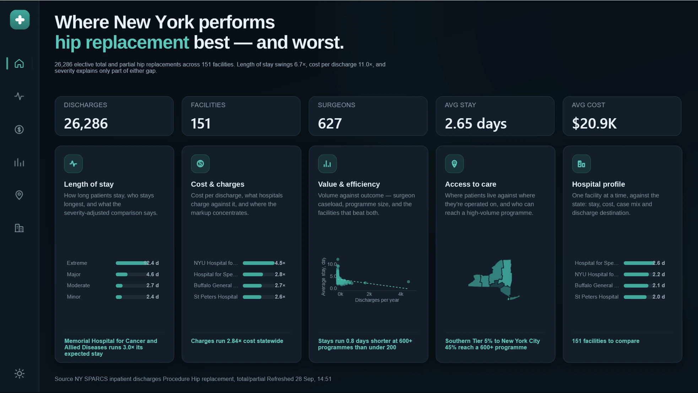
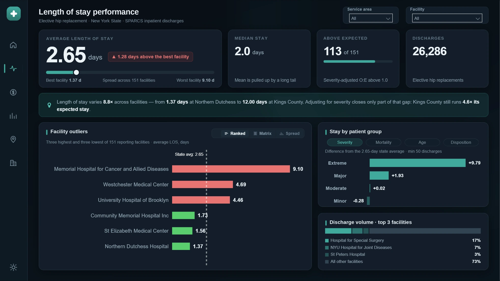
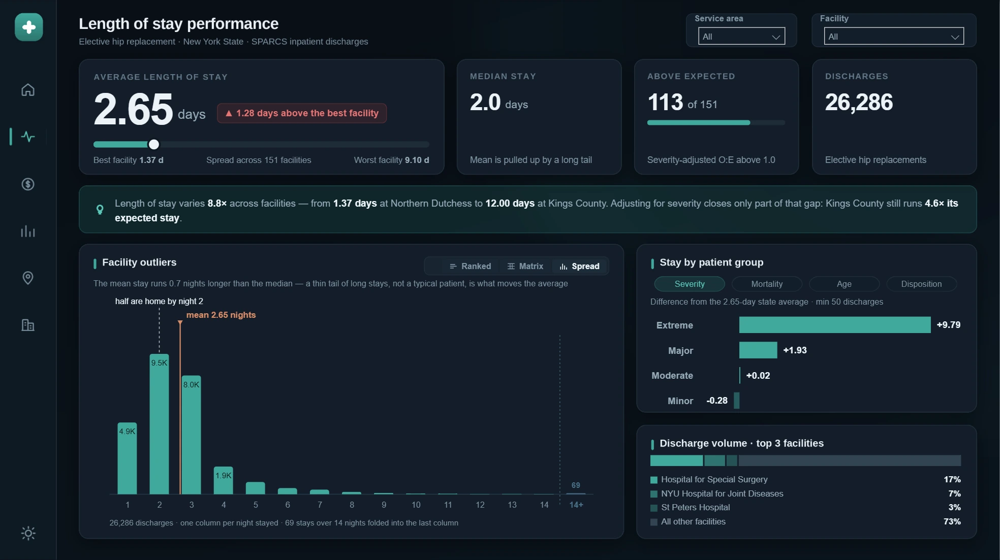
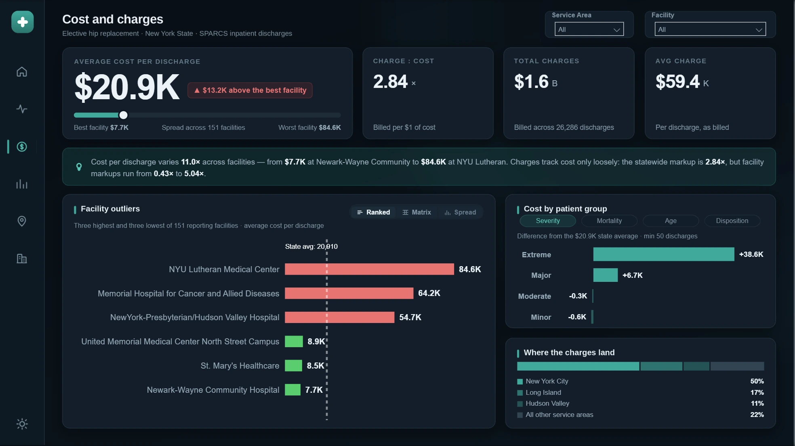
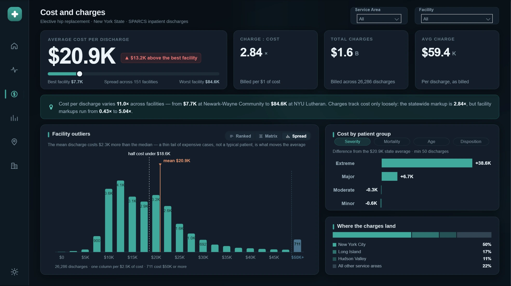
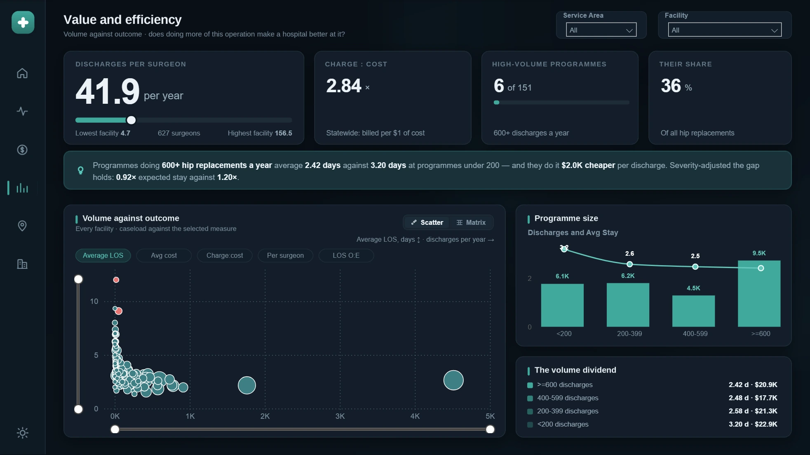
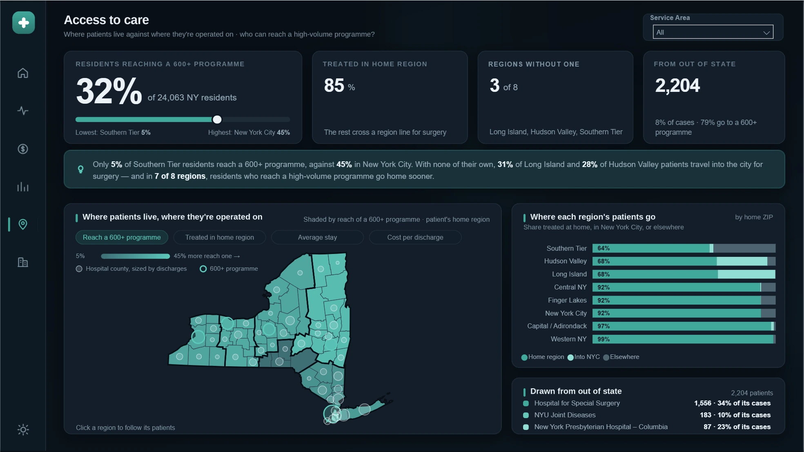

# Power BI Portfolio

Dashboards and semantic models, presented as screenshots and build notes.

Report files, semantic models, DAX and datasets are deliberately not published
here. Each project is written up as a case study — the modelling decisions, the
measures behind the visuals, and the trade-offs made along the way — alongside
screenshots of the working report.

> Every report is built in a dark and a light theme. The screenshots below
> follow whichever theme you are reading GitHub in.

---

# HealthStat — elective hip replacement

**26,286** discharges · **151** facilities · **627** surgeons ·
**2.65 days** average stay · **$20.9K** average cost

Six report pages over every elective total and partial hip replacement
discharged from a New York State hospital in a single year, built around one
question: once you account for how sick the patients are, which hospitals are
actually different?

Raw averages make hospitals look different when mostly they are treating
different patients. The spine of the report is a severity-adjusted comparison:
every facility is scored against the stay and cost its own case mix predicts,
so the pages can separate hospitals that are genuinely outliers from those that
simply admit sicker people.

`Power BI` · `DAX` · `TMDL` · `Deneb / Vega` · `HTML & SVG measures` · `Bookmarks`

## Landing page

<picture>
  <source media="(prefers-color-scheme: light)" srcset="docs/healthstat/img/home-light.webp">
  <source media="(prefers-color-scheme: dark)"  srcset="docs/healthstat/img/home-dark.webp">
  
</picture>

The cohort in five numbers, then a route into each area of the report. Each card
carries its own headline finding rather than a label alone — the stay gap, the
markup, the volume dividend.

## Length of stay

The state average stay is 2.65 days and the median is 2. That gap is the page's
first point: the mean is pulled up by a thin tail, so a facility sitting above
it is not automatically doing anything wrong. 113 of 151 facilities run above
the stay their case mix predicts.

<picture>
  <source media="(prefers-color-scheme: light)" srcset="docs/healthstat/img/los-light.webp">
  <source media="(prefers-color-scheme: dark)"  srcset="docs/healthstat/img/los-dark.webp">
  
</picture>

Three highest and three lowest of 151 facilities — 9.10 days down to 1.37 —
with the severity-adjusted ratio behind it, so a long stay explained by case mix
reads differently from one that is not. The panel holds three views behind the
chips: this ranking, the full matrix, and the distribution below.

<picture>
  <source media="(prefers-color-scheme: light)" srcset="docs/healthstat/img/los-spread-light.webp">
  <source media="(prefers-color-scheme: dark)"  srcset="docs/healthstat/img/los-spread-dark.webp">
  
</picture>

The third view, at patient grain rather than facility grain — a custom Vega
histogram of every discharge by nights stayed. Half are home by night two, but
the mean sits at 2.65, and the chart marks both so the gap is visible rather
than asserted. The 69 stays past fourteen nights fold into a final column,
separated by a dotted rule so it cannot be misread as a fifteenth night.

## Cost and charges

Cost per discharge runs from $7.7K to $84.6K — an eleven-fold spread. What a
hospital bills tracks what it spends only loosely: the statewide markup is
2.84×, and individual facilities sit a long way either side of it — some
billing barely above cost, others several times it.

<picture>
  <source media="(prefers-color-scheme: light)" srcset="docs/healthstat/img/cost-light.webp">
  <source media="(prefers-color-scheme: dark)"  srcset="docs/healthstat/img/cost-dark.webp">
  
</picture>

The same three-view panel applied to cost, with charge-to-cost ratio alongside.
Half of all charges land in New York City.

<picture>
  <source media="(prefers-color-scheme: light)" srcset="docs/healthstat/img/cost-spread-light.webp">
  <source media="(prefers-color-scheme: dark)"  srcset="docs/healthstat/img/cost-spread-dark.webp">
  
</picture>

The same idea applied to cost, in $2.5K bands with everything above $50K capped
into the last column. Half of all discharges cost under $18.6K against a $20.9K
mean — 711 of them cost $50K or more, and those are what move the average. The
banding is a calculated column rather than something the chart does, so each bar
remains a real value of a real field.

## Value and efficiency

Does doing more of an operation make a hospital better at it? Only six of 151
programmes do 600 or more a year, and they handle 36% of the state's volume.
Those programmes average 2.42 days against 3.20 at programmes under 200, and do
it $2.0K cheaper per discharge — and the gap survives severity adjustment, at
0.92× expected stay against 1.20×.

<picture>
  <source media="(prefers-color-scheme: light)" srcset="docs/healthstat/img/value-light.webp">
  <source media="(prefers-color-scheme: dark)"  srcset="docs/healthstat/img/value-dark.webp">
  
</picture>

Every facility plotted as caseload against outcome, with the measure on the
vertical axis switchable between stay, cost, charge-to-cost, throughput per
surgeon and the severity-adjusted ratio.

## Access to care

If high-volume programmes really are better, who can reach one? Just 32% of New
York residents having this operation do. Three of the eight service areas have
no high-volume programme at all, and the spread runs from 5% of Southern Tier
residents to 45% in New York City.

<picture>
  <source media="(prefers-color-scheme: light)" srcset="docs/healthstat/img/access-light.webp">
  <source media="(prefers-color-scheme: dark)"  srcset="docs/healthstat/img/access-dark.webp">
  
</picture>

A custom Vega choropleth of home region against hospital location, shaded by the
measure selected above it. The bars beside it show, for each region, how much of
its volume stays home, how much travels into the city, and how much goes
elsewhere.

## Hospital profile

<picture>
  <source media="(prefers-color-scheme: light)" srcset="docs/healthstat/img/profile-light.webp">
  <source media="(prefers-color-scheme: dark)"  srcset="docs/healthstat/img/profile-dark.webp">
  
</picture>

One facility against the state — volume and rank, stay and cost against
expected, case mix and discharge destination. The written summary underneath is
generated from the measures, so it re-resolves for whichever of the 151
facilities is selected.

---

## How it is built

### Severity adjustment

Expected stay and expected cost come from indirect standardisation: each
facility is scored against the statewide figure for its *own* severity mix,
summed back over its case distribution. The observed-to-expected ratio is then
what the pages actually rank on, rather than the raw average.

> Written with `SUMX` over the severity values and `ALLEXCEPT` to hold the
> severity level while releasing the facility — cheap evaluated once for the
> state, ruinous if evaluated per facility across 151 rows. Where that bit, the
> aggregation was restructured rather than the visual simplified.

### Nothing on screen is typed twice

- **All text is measure-driven.** Titles, subtitles, insight sentences and tile
  footnotes are DAX. Every number and every hospital name in prose re-resolves
  under a filter instead of going stale.
- **Display units follow magnitude.** Figures switch between plain, K, M and B
  by size rather than carrying a fixed suffix, so the same measure reads
  correctly for one hospital or the whole state.
- **Sentences are guarded.** A selection that collapses a comparison rewrites
  the sentence rather than printing a degenerate one.

### Custom visuals where the native ones could not reach

- **Deneb (Vega, not Vega-Lite)** for the distribution views, the region map and
  the range tracks — anywhere the shape of the answer mattered more than the
  convenience of a built-in chart.
- **Banding lives in the model, not the spec.** Stay and cost bands are
  calculated columns, because a visual can only cross-filter on a real column.
  Folding a tail inside the chart would make it a picture; folding it in the
  model keeps every bar a real value.
- **HTML and SVG measures** for the KPI tiles and range sliders, which gives
  exact control over layout and lets the same markup re-theme from the colour
  table.

### Judgement calls worth naming

- **A noise floor, with a reason.** Breakdown bands under 50 discharges are
  blanked. The threshold was set against the data rather than picked: it sits
  below the smallest clinically real groups while excluding bands of fifteen or
  twenty patients that would otherwise top every ranking on delta alone.
- **No trend analysis, deliberately.** The extract carries a single discharge
  year. Rather than manufacture a time axis, the report states that every figure
  is a snapshot — a constraint named is better than a trend implied.
- **Interactions are chosen, not defaulted.** The distribution charts respond to
  slicers and to other visuals but do not filter outward: on a page where every
  measure is a function of stay length, emitting a filter on stay length would
  pin the variable and flatten the page.

## Data

New York State SPARCS de-identified inpatient discharge data, filtered to
elective total and partial hip replacements, for a single discharge year. The
dataset is public and de-identified at source; no record identifies an
individual.

The report definition, semantic model and source extract are not published in
this repository.
